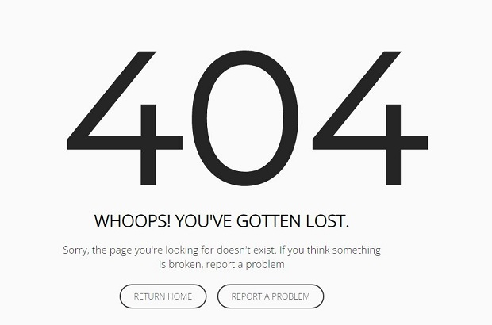
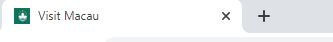

# VISIT MACAU - Overview

Visit Macau is a travel website providing information to users on the S.A.R. region of China - Macau. Information on featured or top attractions to visit and see in Macau. A gallery of images on the website sparks wonder and awe in visitors to the website in the hope they add Macau to their bucket list of places to travel to. The live website can be viewed [here](https://chancandan.github.io/portfolio-project-1/index.html)

## Features 

### Navigation
* Navigation Menu
    * Contains links to the Home, Gallery and Contact US pages and will be responsive on all devices.
    * This will allow users to easily navigate between the pages within the site on any size device. 

    * Design changes to a hamburger menu for mobile users on a smaller screen. 
    * Once clicked by the user it will displays the 3 different link options in a verical column.

 

* Footer
    * This will contain icons as links to social media websites that will open in new tabs. Icons will be accessible to the visually impaired who may be using a screen reader, by the use of aria labels.
    * These various social media links will allow the user to follow Visit Macau's social channels where they can get more up to date information where available and interact with other users or fans of the site.

* 404 Page
    * An error 404 page will be implemented and will display if a user navigates to a broken link.
    * Here, the 404 page will allow the user to a choice to report the broken link or problem by linking back to the contact page or if the user simply wants to contuining browsing on the site they have the option to easily navigate back to the homepage without having to think about using the browsers back button. The option to stay on the site will be offered in an easy manner.

* Favicon
    * An image of Macau's famous white lotus flower will be implemented site wide as a favicon.
    * For users who have a lot of tabs open in their browser this will make locating the Visit Macau page much easier and will help to make it stand out against some sites which don't include this feature.

### Home / Landing Page
* Home page hero image
    * One image of Macau's skyline including the famous Grand Lisboa building will be used as the hero image. It will have a zoom transition.  
    * This image is an at-night shot and the lights of the building will set the tone and convey to the user immediately that Macau is very well known for it's nightlife and will put this association in the user's mind.

* Featured Attractions
    * A pick of 4 of the top featured tourist tractions in Macau. Useful information to the user in where to go and what to see.
    * This section also protrays to the user what the website is all about, if they haven't already grasped it at this stage.
    * The implementation of icons above featured attraction from the 'Font Awesome' website. Each icon is related to their attraction underneath and immediately gives the user a clue as to what each attraction is without having to read the text included.
    * Carefully selected images of each attraction that markets an emotion in the user, e.g. the blue sky in the St Paul's ruins image.

