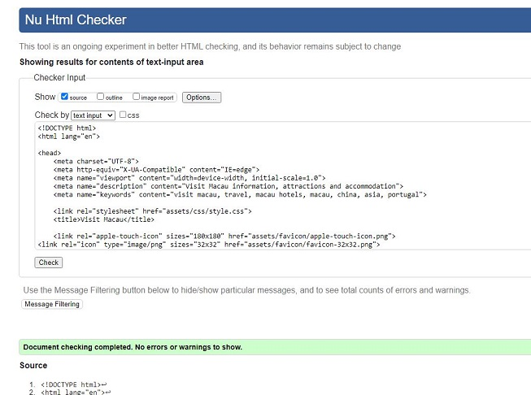
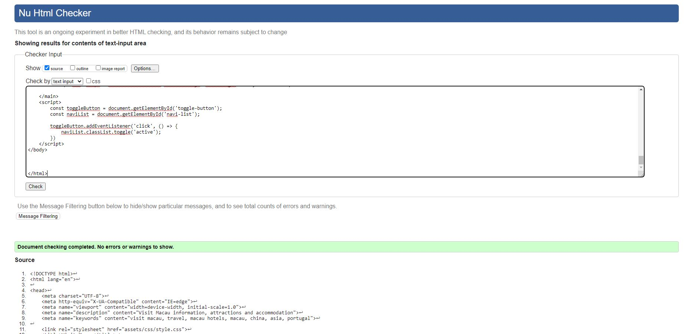

# VISIT MACAU - Overview

Visit Macau is a travel website providing information to users on the S.A.R. region of China - Macau. Information on featured or top attractions to visit and see in Macau. A gallery of images on the website sparks wonder and awe in visitors to the website in the hope they add Macau to their bucket list of places to travel to. The live website can be viewed [here](https://chancandan.github.io/portfolio-project-1/index.html)


## Features 

### Navigation
* Navigation Menu
    * Contains links to the Home, Gallery and Contact US pages and will be responsive on all devices.
    * This will allow users to easily navigate between the pages within the site on any size device. 

    * Design changes to a hamburger menu for mobile users on a smaller screen. 
    * Once clicked by the user it will displays the 3 different link options in a verical column.

 

* Footer
    * This will contain icons as links to social media websites that will open in new tabs. Icons will be accessible to the visually impaired who may be using a screen reader, by the use of aria labels.
    * These various social media links will allow the user to follow Visit Macau's social channels where they can get more up to date information where available and interact with other users or fans of the site.


* 404 Page
    * An error 404 page will be implemented and will display if a user navigates to a broken link.
    * Here, the 404 page will allow the user to a choice to report the broken link or problem by linking back to the contact page or if the user simply wants to contuining browsing on the site they have the option to easily navigate back to the homepage without having to think about using the browsers back button. The option to stay on the site will be offered in an easy manner.


* Favicon
    * An image of Macau's famous white lotus flower will be implemented site wide as a favicon.
    * For users who have a lot of tabs open in their browser this will make locating the Visit Macau page much easier and will help to make it stand out against some sites which don't include this feature.


### Home / Landing Page
* Home page hero image
    * One image of Macau's skyline including the famous Grand Lisboa building will be used as the hero image. It will have a zoom transition.  
    * This image is an at-night shot and the lights of the building will set the tone and convey to the user immediately that Macau is very well known for it's nightlife and will put this association in the user's mind.


* Featured Attractions
    * A pick of 4 of the top featured tourist tractions in Macau. Useful information to the user in where to go and what to see.
    * This section also protrays to the user what the website is all about, if they haven't already grasped it at this stage.
    * The implementation of icons above featured attraction from the 'Font Awesome' website. Each icon is related to their attraction underneath and immediately gives the user a clue as to what each attraction is without having to read the text included.
    * Carefully selected images of each attraction that markets an emotion in the user, e.g. the blue sky in the St Paul's ruins image.


* Section breaker
    * The use of a hr element with a section symbol to break the featured attractions section from the next section of the informational videos.


* Why Choose Macau?
    * The implementation of embedded Youtube videos via the use of iframes to market Macau as a destination to visit and to give the user a better understanding of what kind of a place Macau is with the images they'll see in the videos.


### Gallery Page
* Gallery
    * Once navigating to the gallery page the user can view different images of Macau on their screens which have interactive effects once the user hover their cursor over them on desktop.
    * Each image is of a high quality and carefully selected to market6 Macau to the user ina  positive light. The gallery is responsive and it will allow the user to view the content in an eye-catching way on any device. 


### Contact Us Page
* Contact us form
    * A contact  form will be implemented to allow users to contact the site. The form will consist of the following fields and attributes: 
        * First Name (required, type=text)
        * Last Name (required, type=text)
        * Email (required, type=email)
        * Radio (required, type=radio)
        * Message (required, type=textarea)
    * Having successfully filled out all required fields and clicking the submit button on the contact form, a 'Thank You' message will appear as the user will be navigated to a thank-you.html page that will resemble the contact us page.
    * This form will allow the user to contact Visit Macau if they have any further questions or require any more information. 


### Existing Features

* Responsive design
* 4 featured attractions
* Interactive google map
* Hero image with zoom transition
* Contact form and thank you / success page
* 2 videos for users to interact with via playback functions
* Responsive gallery with zoom and opacitiy transitions on hovering


### Features Left to Implement

* Hotels information section

* I'd also like for my contact form to actually submit the information to the domain or to a point of data collection. 


## Design

### Wireframes
<br>
Landing / Home page
<br><br>


<br>
Gallery page
<br><br>


<br><br>
Contact US form successful submission thank you page.
<br><br>


## Technologies

* HTML5
    * The structure of the Website was developed using HTML5 as the main language.
* CSS3
    * The Website was styled using custom CSS3 in an external file.
* GitHub
    * Source code is hosted on GitHub and delpoyed using Git Pages.
* Git 
    * Used to commit and push code during the development opf the Website
* Font Awesome
    * Icons obtained from https://fontawesome.com/ were used as the Social media links in the footer section and also for the icons above the featured attractions section on the main page. 
* Tinyjpg
    * https://tinyjpg.com/ was used to reduce the size of the images used throughout the website
* Favicon.io
    * favicon files were created at https://favicon.io/favicon-converter/ 
* Balsamiq
    * wireframes were created using balsamiq from https://balsamiq.com/wireframes

    ## Testing 

### Responsiveness

All pages were tested to ensure responsiveness on screen sizes from 320px and upwards as defined in [WCAG 2.1 Reflow criteria for responsive design](https://www.w3.org/WAI/WCAG21/Understanding/reflow.html) on Google Chrome, MicrosoftEdge, Mozilla Firefox and Safari.

Steps to test:

1. Open browser and navigate to [Visit Macau](https://chancandan.github.io/portfolio-project-1/index.html)
2. Open the developer tools (right click and inspect)
3. Set to responsive and decrease width to 320px
4. Set the zoom to 50%
5. Click and drag the responsive window to maximum width

Expected:

Website is responsive on all screen sizes and no images are pixelated or stretched.
No horizontal scroll is present.
No elements overlap.

Actual:

Website behaved as expected on all browsers.

Website was also opened on the following devices and no responsive issues were present seen:

- HP Laptop 15 -bs1xx
- Lenovo Chromebook
- iPhone SE
- iPhone X
- iPhone 14 Pro Max
- iPad (6th Generation)
- MacBook Air

## Lighthouse

Visit Macau was taken through Google Chrome's Lighthouse testing.


I did run random Lighthouse tests at several points throughout the development of the project, both for desktop and mobile devices, however the images above are of the final scores for the site.

Lighthouse recommended converting images to different formats and also resizing images if their actual size wasn't required. After ahereing to these changes the site's performance improved. An example below of a lower score I had before some changes.


Another example below of an old Gallery Page Lighthouse score where the mobile score on 


### Accessibility

The site was tested with the tool [Wave Accessibility](https://wave.webaim.org/) for final testing o to check for any aid accessibility errors and none were present, although I did take note throughout the site's development to keep on top of this aspect, as I knew it weighed heavily on this first project. I scored well on accessibility in Lighthouse also when testing the site with that tool.

Testing was focused to ensure the following criteria were met:

- An English lang attribute was set.
- Any image used on site had an alt tag attached with descriptive text for users requiring screen readers to access the site.


### Bugs

Bugs were found along the way and correct, as well as countless errors which were fixed. All were a learning curve and helped better my understanding of both HTML5, CSS3 and how they interact with each other. One such example was my absence of headings in my structure. I learned the key importance of headings and that they play a key role in the structure of HTML5. The below example was easily fixed by including a h2 element inside of my section. Fix image also shown beneath.
<br>


- Bugs were in the form section of the contact page where I hadn't correctly linked 'for' and 'id' attributes together for the radio button part of the form. This was easily enough to fix once my attention was drawn to the bug.

- I had erros and bugs  in the javascript part of my code for the hamburger menu toggle function. This caused a panic in me as we had not yet learned Javascript as part of the course and this was an extra feature that I went off and tried to learn to implement myself. It took me a couple of hours of troubleshooting and I thought I might have to remove the hamburger menu altogether which I wanted to try to avoid as I think it's a lovely feature for mobile users of the site. Then the penny dropped and I realised I'd put that section of code between the closing body element and the closing html element. All I had to do to fix this problem was simply move this section of code up above the closing body element tag. 

### Unfixed Bugs
Responsiveness of the website worked on all devices, screen sizes and orientation. No further bugs have been found or left unresolved at this stage.

## Deployment

### Deployment to Github Pages

- The Visit Macau site site was deployed to GitHub pages. The following steps were taken when deploying: 
  - Navigate to the Settings tab in the GitHub repository 
  - Select 'Pages' from the menu on the left of the screen
  - Select the 'Branch: main' option from the drop-down menu in the source section
  - Then click 'Save'
  - After a short wait a live link will be appear in a green banner when published successfully. 

Visit Macau's live link can be found here - https://chancandan.github.io/portfolio-project-1/index.html


### Version Control

During the development of the site, When pushing code to the remote repository, I used the following git commands 

```git add .``` - All files added to a staging area awaiting the commit phase.

```git commit -m “specific commit message”``` - To commit changes to the local repository queue where they become ready for the push phase.

```git push``` - All commited code would be then pushed to the site's repo on github.


### Validator Testing 

- HTML
  - All files returned no errors when passed through the official [W3C validator](https://validator.w3.org/nu/?doc=https%3A%2F%2Fcode-institute-org.github.io%2Flove-running-2.0%2Findex.html)







- CSS
  - No errors were found when passing through the official [(Jigsaw) validator](https://jigsaw.w3.org/css-validator/validator?uri=https%3A%2F%2Fvalidator.w3.org%2Fnu%2F%3Fdoc%3Dhttps%253A%252F%252Fcode-institute-org.github.io%252Flove-running-2.0%252Findex.html&profile=css3svg&usermedium=all&warning=1&vextwarning=&lang=en#css)

  

  ## Credits 

A variety of contributors and help went into the development this website:

### Content 

- The text for the 'Featured Attractions' section on the landing page was taken from the following websites: 'Macau Lifestyle', 'Travel China Guide', 'Culture Trip' and 'Wikipedia'.
- The icons in the footer and also in the featured attractions section were taken from [Font Awesome](https://fontawesome.com/) and the Love Running video tutorial was used to implement them.
- I learned how to code my navigation bar from a Youtube tutorial by @cemeygimedia
- The code for styling the CSS of my hr elements from taken from ibrahimjabbari at codepen.io
- The code for the iframe map was from Coder's Coffeehouse by Code Institute
- My 404 page was based on Youtube tutorial by @CodingNepal
- The idea for a Thank You for submitting page was a suggestion from my mentor, Gareth McGirr
- The hamburger menu javascript code was pieces together from tutorials from https://medium.com/@codefoxx/how-to-create-a-responsive-hamburger-menu-with-html-css-javascript-4dc10a45d3 and reading different various Stackoverflox.com questions and answers.


### Media

- The Logo image was created by using an image from https://depositphotos.com/ and I then used an editor in https://pixlr.com/ to write the text on the logo.
- The hero image on the landing page was taken from tatlerasia.com
- The images used for the gallery page were taken from this other open source site
- Various images in the Gallery Page were taken from the www.trip.com website
- The Grand Lisboa between apartment buildings in the gallery was taken from https://www.peakpx.com/
- Video 1 on landing page is from https://www.youtube.com/watch?v=ZAW6vQAxbUA
- Video 2 is from https://www.youtube.com/watch?v=A6jyJ9rbFmE
- The image of the Galaxy hotel and casino is from zodiaclightning.com
- The image of the girls in front of St Paul's Cathedral from taken from Macau Closer magazine
